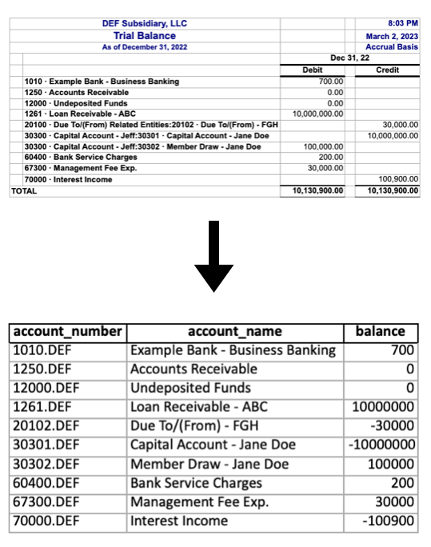

# Projects
## [House Price Prediction - Ames Iowa](https://github.com/jacxson/aimes_iowa_house_price_predicstion)
For this project I have been hired by a mock real estate investment advisory group to help develop a better house price prediction model for the Ames Iowa region. The setting is around the end of 2010, in a housing market that is still reeling from the impacts of the 2008 crash that has left investors uncertain about how to accurately price houses, given the recent volatility. The firm currently uses a relatively simple model that served them well in the past and provided for easy interpretability, but given the circumstances, a more robust model is needed to safely navigate these waters.

The success of this project will be measured by:

Delivering a model with a significant (30-40%) increase in performance over the current model in use.
Conveying the strengths and limitations of the model in such a way that it can be useful to incread the profitability and reduce the risk of real estate investment ventures moving forward.

## [Public Spending and Standardized Test Scores](https://github.com/jacxson/public_spending_and_test_scores)
While the many studies that have called into question the usefulness of standardized testing as a measure of student potential and ability have their merits, as long as these tests remain one of the primary tools that colleges and universities employ to evaluate student achievement, we cannot neglect to expolore the most promising aveneues for making these measures more equitable and more representative of student potential. One of the primary ways that policy makers can approach this question is by analyzing the relationships between public funding and student achievement.

I am seeking to explore whether there are general trends that exist between public spending on education and welfare and student achievement on the SAT and ACT. Does higher per capita spending on education translate to higher average test scores, especially in the states that consistently perform at the lowest levels? Does public welfare spending per capita follow a similar trend? Is either education or public welfare more closely aligned with student achievement? And, given the trends analyzed above, where would resources be most effectively allocated to conduct further research into improving student achievement for the most disadvantaged students?

## [Python for CPAs: ](https://jacxson.github.io/Python-for-CPAs/)
A collection of jupyter notebooks that illustrate scalable extract transform load workflows for accountants. Building on the idea that coding is not just for software engineers, this project is meant to show that ETL scripts are not just for data engineers! Anyone who regularly receives data in a given (often messy) format and needs to perform some kinds of transformations on that data to make it useful could benefit from learning to clean data with python.
---
### 1) [Trial Balance: From QuickBooks to CCH Engagement](https://github.com/jacxson/Trial-Balance-Formatting)

#### Overview
Formatting trial balance data from quickbooks exports to import into CCH Engagement can be tedious work, especially for clients with multiple subsidiaries. While it is manageable for companies with 3 or 4 subsidiaries to handle this work in excel, what if there are dozens of them? And what if each entity has hundreds of accounts? This project was inspired by a real world scenario working in an audit and assurance practice where I was asked to format the trial balances for a company with 75 subsidiaries. I decided it was time to put together a scalable ETL workflow for trial balance data. The notebooks in this project assume some basic knowledge of python inlcuding data types, control flow, and functions, and the pandas library. If you would like to jump straight into the code, check out the [example notebook](https://github.com/jacxson/Trial-Balance-Formatting/blob/main/example_notebook_tb_formatting.ipynb) or the corresponding [etl script](https://github.com/jacxson/Trial-Balance-Formatting/blob/main/trial_balance_etl.py) (the two are essentially identical). If you would like a more step by step guide that lays out how I arrived at the code in those files, check out the [tutorial notebook](https://github.com/jacxson/Trial-Balance-Formatting/blob/main/tutorial_notebook_tb_formatting.ipynb). If the code in these notebooks is a little more advanced than your current knowledge of python, but you are curious to learn more about pythonic approaches to accounting workflows, feel free to reach out on [LinkedIn](https://www.linkedin.com/in/jacxson). I'd love to chat!
### 2) Lease Accounting: From Lease Schedules to LeaseCrunch (Coming Soon!)
---
# About

## [Connect on LinkedIn](https://www.linkedin.com/in/jacxson)
